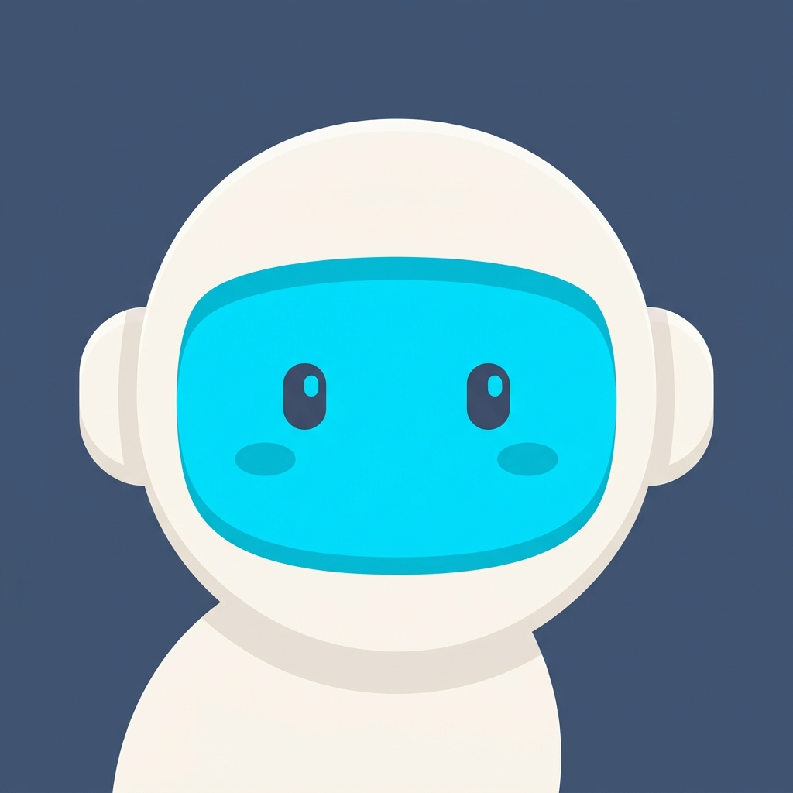
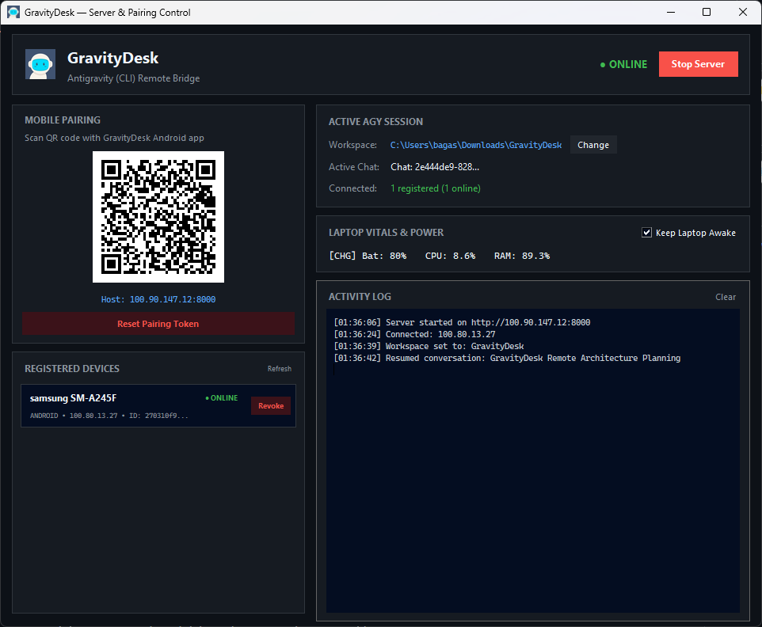
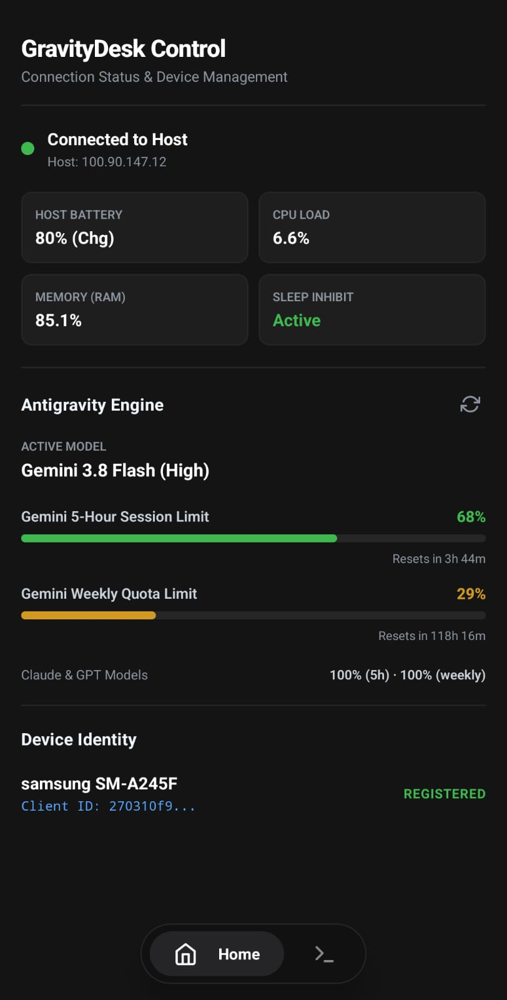
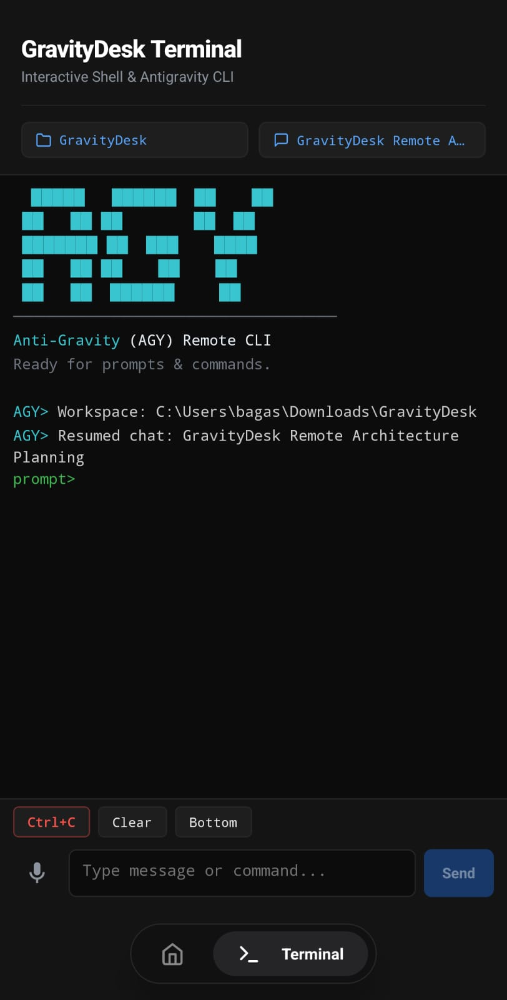

<div align="center">



# GravityDesk

### **Self-Hosted Remote Control System for Google Antigravity (`agy`) CLI & Windows Workstations over Tailscale**

[](https://www.python.org/)
[](https://fastapi.tiangolo.com/)
[](https://docs.microsoft.com/en-us/windows/console/)
[](https://tailscale.com/)
[](https://reactnative.dev/)
[](#security-architecture)
[](LICENSE)

*Control, prompt, and monitor autonomous Google Antigravity AI coding sessions on your Windows workstation straight from your Android phone — wherever you are, zero cloud intermediaries required.*

</div>

---

## 🌟 Highlights

- 🖥️ **Modern Desktop GUI Control Center**: Clean dark-mode Tkinter management window showing host status, detected Tailscale IPv4, dynamic high-resolution QR pairing code, 1-click token copy, workspace picker, and real-time activity log.
- ⚡ **Zero-Lag ConPTY Virtual Terminal**: Native Windows Pseudo Console (`pywinpty`) integration streaming ANSI output directly over WebSocket with a 3,000-chunk ring buffer for lossless session catch-up.
- 🧠 **Google Antigravity (`agy`) First-Class Citizen**: Autonomous session continuity with `--dangerously-skip-permissions`, mobile-responsive ASCII welcome banner, and real-time conversation resume synchronized directly with local Antigravity SQLite storage.
- 📊 **Live Antigravity Engine & Quota Telemetry**: Real-time active model detection (`settings.json`, e.g., Gemini 3.8 Flash (High)), 5-hour session quota, and weekly quota limits with exact reset countdowns (`Resets in 123h 29m`), cached with zero CPU overhead and refreshable on-demand.
- 🪟 **Zero-Popup Headless Background Execution**: All Windows background subprocesses (including `agy -p /usage` and audio transcoding) run strictly with `CREATE_NO_WINDOW`, ensuring the developer's workstation screen never flashes or flickers CMD prompt windows.
- 🛡️ **Subprocess Concurrency Guard**: Single-flight prompt lock in `SessionHub` blocks overlapping execution requests and prevents runaway background tasks.
- 🎙️ **Remote Voice-to-Text Dictation Pipeline**: Native voice prompt bar with automated `ffmpeg` audio normalization to 16kHz PCM WAV and Google Speech Recognition fallback for hands-free agent steering.
- 📱 **Native Android Companion App**: Auto-expanding WhatsApp-style multiline prompt input, 1:1 mathematically aligned screen headers, quick signals (`Ctrl+C`), and live workstation vitals (CPU %, RAM %, Battery %, Charging status).
- 🧭 **Multi-Drive Breadcrumb Workspace Navigator**: Explore and switch project folders effortlessly across physical Windows drive roots (`C:\`, `D:\`) right from mobile.
- 🚫 **Instant Access Revocation**: One-click 256-bit cryptographic token rotation instantly locks out stale or lost mobile sessions and invalidates active connections in real time.
- 🔒 **Zero-Trust Defense-in-Depth**: Operates exclusively over encrypted Tailscale WireGuard mesh tunnels, timing-safe authentication (`hmac.compare_digest`), path-traversal safeguards, and strict command execution allowlists.
- 🔋 **Windows Sleep Inhibit**: Prevents host laptops from entering standby or suspend mode during active remote sessions using the native Win32 API (`kernel32.SetThreadExecutionState`).

---

## 📸 Interface Preview

<div align="center">

### 🖥️ Desktop Host Control Center
*Modern Windows dark-mode dashboard with dynamic QR pairing, hardware vitals, active session management, and instant access revocation.*

<br/>

<br/><br/>

### 📱 Android Companion App
*Control autonomous agent sessions, monitor Gemini quota limits, switch workspaces, and steer execution with voice or touch.*

<br/>

| **Mobile Dashboard & Engine Telemetry** | **Interactive Terminal & Voice Prompting** |
|:---:|:---:|
|  |  |
| *Real-time host vitals & Gemini/Claude quota tracking* | *Zero-lag ConPTY terminal, breadcrumb nav & voice STT* |

</div>

---

## 🛠️ Tech Stack

| Layer | Technologies |
|---|---|
| **Host Workstation** | Windows 10 / 11, Python 3.12+, Tkinter, Pillow, Win32 API, `ffmpeg` |
| **Backend Daemon** | FastAPI, Uvicorn, `pywinpty`, `psutil`, `qrcode`, `SpeechRecognition`, `pydub`, SQLite |
| **Networking** | Tailscale (WireGuard Mesh), WebSocket (`/ws/terminal`), HTTP REST |
| **Mobile Native** | React Native, Expo, TypeScript, `expo-secure-store`, `expo-av`, `lucide-react-native` |
| **Target Engine** | Google Antigravity CLI (`agy`), Gemini / Claude / GPT models |

---

## 🚀 Quick Start

### 1. Prerequisites

- **Windows Workstation**: Windows 10 or 11.
- **Python**: Version `3.12+` installed and added to `PATH`.
- **Google Antigravity**: `agy` CLI installed globally and authenticated.
- **Tailscale**: Installed and signed in on both your Windows PC and your Android phone on the same tailnet.
- **FFmpeg** *(Optional)*: Required only if you want remote voice-to-text dictation. Typing prompts, running terminal commands, and telemetry work 100% without it.

### 2. Installation

Clone the repository and install the verified dependencies:

```bash
git clone https://github.com/w1th0ut/GravityDesk.git
cd GravityDesk
pip install -r requirements.txt
```

#### *(Optional)* Enable Voice Dictation with FFmpeg

If you want to use the hands-free voice-to-text dictation feature from your Android phone, install FFmpeg on your Windows workstation:

```powershell
# Option A: Windows Package Manager (WinGet - Recommended)
winget install Gyan.FFmpeg

# Option B: Chocolatey
choco install ffmpeg

# Option C: Scoop
scoop install ffmpeg
```

> [!NOTE]
> FFmpeg is **completely optional**. GravityDesk operates normally without it; you will only receive an in-app notice on Android if you attempt to record a voice prompt without FFmpeg installed on the host.

### 3. Launching the Control Center

Start the Desktop GUI Control Center using Python:

```bash
# Direct Python invocation
python gui.py
```

The GravityDesk Control Center will launch:
1. Automatically resolves your workstation's **Tailscale IPv4 address**.
2. Loads (or generates) your **256-bit cryptographic auth token**.
3. Renders a high-contrast **QR Code** directly in the desktop window.
4. Starts the background FastAPI server on port `8000`.

### 4. Installing & Pairing the Mobile App

1. **Download Android App**: Grab the latest `gravitydesk-vx.x.x.apk` directly from [**GitHub Releases**](https://github.com/w1th0ut/GravityDesk/releases) and install it on your Android phone.
2. **Connect Tailscale**: Ensure both your Windows PC and your Android phone are signed into the same Tailscale network.
3. **Pair Instantly**:
   - Launch GravityDesk on your phone.
   - Tap **Scan QR** and scan the **MOBILE PAIRING** QR code displayed in your Desktop GUI.
   - You are connected instantly with sub-50ms latency over your private WireGuard mesh tunnel!

---

## 🔒 Security Architecture

GravityDesk is engineered with institutional-grade security principles for remote execution:

- **Private WireGuard Mesh**: The server binds exclusively within your private Tailscale network (`100.x.y.z`). No ports are forwarded to the public internet, completely eliminating external attack surfaces.
- **Cryptographic Token Handshake**: Authentication requires a 256-bit token generated via Python's `secrets.token_hex(32)`. Requests are validated using constant-time comparison (`hmac.compare_digest`) to protect against side-channel timing attacks.
- **Instant Revocation**: Compromised your phone or lost access? Tap **🚫 Reset Pairing Token** in the Desktop GUI. GravityDesk generates a new 256-bit secret, overwrites `.env`, and invalidates all existing sessions immediately.
- **Binary Allowlist**: Spawning arbitrary executables is prohibited. Only pre-vetted shells (`cmd.exe`, `powershell.exe`) and Google Antigravity (`agy.exe`) are permitted.
- **Path Traversal Protection**: Folder browsing requests are sanitized via `os.path.realpath`, validating paths against physical drive roots (`C:\`, `D:\`) to block traversal exploits.
- **Headless Process Sandboxing**: Background executions run with `CREATE_NO_WINDOW` and concurrency mutex locks to prevent desktop UI disruption and runaway process cascades.

---

## 📱 Mobile UI Features

| Feature | Description |
|---|---|
| **Antigravity Quota Monitor** | Seamless dashboard card showing active model (e.g., `Gemini 3.8 Flash (High)`), 5-hour session quota, and weekly limits with exact countdown timers (`Resets in Xh Ym`) and on-demand refresh. |
| **Voice-to-Text Dictation** | One-tap voice prompt bar utilizing native audio recording and host-side `ffmpeg` + speech recognition for hands-free agent steering. |
| **Workspace Selector** | Interactive multi-drive breadcrumb navigation modal (`C:\`, `D:\`) to effortlessly switch project folders without touching your workstation. |
| **Session Resume** | Direct integration with Antigravity SQLite database to resume prior chat conversations by summary and timestamp. |
| **Quick Action Toolbar** | Dedicated touch buttons for `Ctrl+C` (SIGINT interrupt), `Enter`, and workspace/resume management. |

---

## 🧪 Testing & Verification

GravityDesk includes an automated integration test suite verifying authentication entropy, ConPTY process lifecycle, path traversal boundaries, and endpoint security:

```bash
# Run the integration test suite
python -m pytest tests/
```

All tests execute synchronously against the FastAPI test harness with zero network overhead.

---

## 📂 Project Structure

```
GravityDesk/
├── assets/                    # Brand assets, preview banner & UI screenshots
│   ├── logo.png               # Official Astro-Orb mascot logo (512x512)
│   ├── logo.ico               # Windows application & taskbar icon
│   ├── social-preview.png     # Repository social preview banner
│   ├── server-view.png        # Desktop Control Center screenshot
│   ├── home-view.jpeg         # Mobile dashboard & quota telemetry screenshot
│   └── terminal-view.jpeg     # Mobile ConPTY terminal & voice screenshot
├── server/                    # Backend daemon bounded context
│   ├── main.py                # FastAPI app, REST endpoints, WebSocket hub
│   ├── terminal.py            # Windows ConPTY runner & sequence ring buffer
│   ├── antigravity.py         # AGY active model reader & quota telemetry
│   ├── system.py              # Telemetry vitals & Win32 sleep inhibitor
│   ├── network.py             # Tailscale IP resolver, token generator & QR
│   ├── conversations.py       # AGY SQLite resume & session sync
│   ├── workspaces.py          # Directory explorer & path safety validation
│   ├── devices.py             # Mobile device pairing & identity registry
│   └── gui.py                 # Desktop GUI Control Center (Tkinter)
├── mobile/                    # React Native / Expo client bounded context
│   ├── App.tsx                # Main mobile application entrypoint
│   └── src/
│       ├── screens/           # Tab screens (HomeScreen, TerminalScreen)
│       ├── components/        # UI components (TerminalView, PromptBar, Modals)
│       ├── api/               # Typed REST API & WebSocket client
│       ├── hooks/             # Terminal, vitals, and pairing lifecycle hooks
│       ├── storage/           # Token and device persistence (expo-secure-store)
│       └── types/             # Domain TypeScript interfaces
├── tests/                     # Integration test suite
│   └── test_server.py         # Security, ConPTY, and endpoint harness
├── gui.py                     # Desktop GUI root launcher
├── requirements.txt           # Python package dependencies
├── LICENSE                    # MIT Open Source License
└── AGENTS.md                  # Autonomous agent operational manual
```

---

## 🛣️ Roadmap

- [x] Windows ConPTY terminal runner with async WebSocket streaming
- [x] Tailscale auto-detection & 256-bit token authentication
- [x] Real-time hardware vitals (CPU, RAM, Battery, AC status)
- [x] Dynamic QR Code pairing & Instant Access Revocation
- [x] Modern Tkinter Desktop Control Center
- [x] AGY conversation history sync from SQLite
- [x] Mobile WhatsApp-style multiline prompt bar & Voice STT pipeline
- [x] Real-time Antigravity engine active model & quota usage telemetry (`/usage`)
- [x] Zero-popup headless background execution (`CREATE_NO_WINDOW`)
- [x] Multi-drive breadcrumb workspace explorer
- [x] Official Astro-Orb brand identity & adaptive Android icon
- [x] Standalone Android APK build (`expo prebuild` / EAS)
- [ ] Multi-OS host support (Linux & macOS)
- [ ] Push notification alerts on AGY prompt completion or error
- [ ] Biometric fingerprint authentication on mobile app

---

## 📄 License

This project is licensed under the MIT License — see the [LICENSE](LICENSE) file for details.

Developed as a high-performance developer tool for the Google Antigravity ecosystem.

